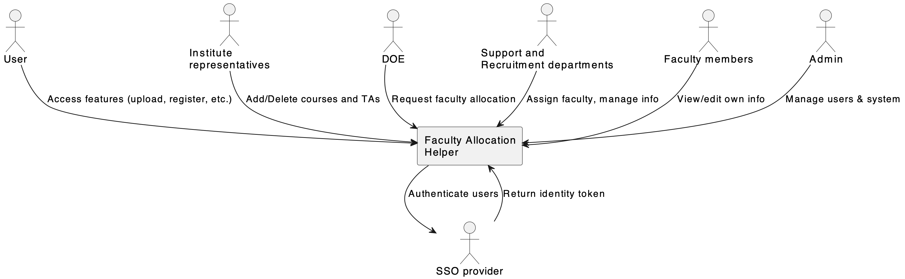

# 🎓 Faculty Allocation Helper

> A tool for simplifying the faculty allocation in Innopolis University

🔗 [Link to the deployed version](https://facallhelp.ru)

📹 [Demo video](https://drive.google.com/file/d/1etbRiZlviE2BXqW-ShE9jJlDH_Bad_Zv/view?usp=share_link)

---

## 🎯 Project Goal and Description

Faculty Allocation Helper is a system designed to streamline faculty allocation across courses and programs. The client currently uses a large, complex spreadsheet to manage this process, involving multiple stakeholders such as hiring departments, course planners, and academic administrators. The goal is to replace this spreadsheet with a structured, user-friendly solution tailored to diverse user needs.

## 🧩 Project Context Diagram

Project context diagram with key stakeholders and external systems:

## 🗺️ Feature Roadmap

- [x] Registration/Authentication
- [x] Adding faculty
- [x] Data extraction from Excel tables
- [x] HTTP to HTTPS conversion
- [X] Adding courses
- [ ] Authorization via SSO
- [ ] Information archive of previous years
- [ ] Varying functionality for different user types
- [ ] Workload calculation

## 📘 Usage Instructions / User Guide

Once you register or sign in, you appear at the home page of the website. Use the header navigation bar for switching to other pages.

If you click on the "Courses" section, a course list appears. You can click on the side menu to see course filtering options. You can add a new course or interact with the course cards. First of all, the course names are clickable and will lead toy to the course profile. Secondly, under "Teaching assistants" section of the course card, you can find the "Assign new" button and interact with the pop-up menu to assign either a new or an existing faculty member to a specific teaching position.

If you click on the "Facuty" section of the navigation bar, a faculty list appears. Here you can also open the side-menu for filtering options. You can all a new faculty member or see the existing faculty. If you click on the name of the employee, a pop-up window with their profile will appear.

If you click on the "Logs" section, the action log list will appear. 

If the user icon on the right of the navigation bar depicts the user profile, which is work in progress for now.

## 🔗 Accessing the Application

Follow the link: https://facallhelp.ru

To use the application, you should register or sign in.
1) To sign up use innopolis mail, e.g. m.pezer@innopolis.university
2) The password should be 9 or more symbols - Not necessarily the same as in your innopolis account
3) If you are already signed up in OUR web application - use existing mail and pass - it is checked by the system of authentication

---

## 📚 Documentation

All project documentation is organized into dedicated Markdown files. Click through to explore each section:

- **Development Guide** ([CONTRIBUTING.md](CONTRIBUTING.md))  

- **Quality Assurance**  
  - Quality characteristics & attribute scenarios ([docs/quality-attributes/quality-attribute-scenarios.md](docs/quality-attributes/quality-attribute-scenarios.md))  
  - Automated tests ([docs/quality-assurance/automated-tests.md](docs/quality-assurance/automated-tests.md))  
  - User acceptance tests ([docs/quality-assurance/user-acceptance-tests.md](docs/quality-assurance/user-acceptance-tests.md))

- **Build & Deployment Automation**  
  - Continuous Integration ([docs/automation/continuous-integration.md](docs/automation/continuous-integration.md))  

- **Architecture** ([docs/architecture/architecture.md](docs/architecture/architecture.md))  
